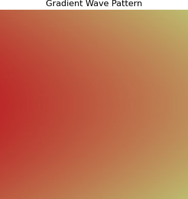
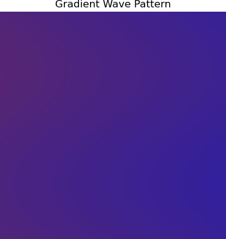
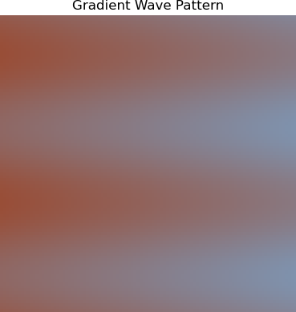

# Assignment 1: NumPy Array Manipulation for 2D Pattern Generation

[View on GitHub]({{ site.github.repository_url }})

## Objective

The goal of this assignment is to create a Python program using NumPy to manipulate a 2-dimensional array and transform a blank canvas into a patterned image. You are asked apply various array operations, introduce randomness, and work with RGB channels to produce full-color images.

Assignment 1
## Table of Contents

- [Pseudo-Code](#pseudo-code)
- [Technical Explanation](#technical-explanation)
- [Results](#results)
- [References](#references)

---

## Pseudo-Code
1. **Create canvas and rgb**
- Set canvas dimensions, this was arbitrarily set to 100x100.
- Introduce a blank canvas of zeros and the 3 colour channels (RGB).

2. **Choose random RGB for the left and right side of the divide**
- Use random to choose an integer between 0 and 255 for each colour channel and each side, so for example left_red is assigned some number from 0 to 255.
- Finding the average colour channels by adding the left red and right red then dividing by two gives the "average" colour between the two. This we will need to create the gradiants that goes from either side of the image towards the middle.

3. **Setup parameters for the sine curve**
- A sine curve is defined by amplitude: the height of the waves - and the frequency: number of waves.
- For the amplitude we define it by the width of the image, so some number smaller than 1 is multiplied with the width (so it does not become bigger than the image) in this case 0,2.

4. **Create a for loop to determinne the colour of each pixel**
- In this loop a parameter called "t" is introduced to represent a value from 0 to 1 that determine colour of each pixel.
- The closer to 0 t is means it is at the middle of the sine curve, thus the closer to 1 it is at either the left or right side of the sine curve.
- RGB values are then generated for the t domain between 0 and 1

5. **Assign colour to (y,x) coordinates**
- The loop then repeats assigning a RGB value to each (x,y) coordinate depending on the t parameter.

5. **Visualize and Save Image**
- Use Matplotlib to display the image.
- Save the image to the `images/` folder.

---

## Technical Explanation
In this assignment I wished to experiment with colour gradients and have them mesh together in a organic way, as i find these colour interactions inherently interesting.
I began with creating a canvas to paint on with np.zeros of an arbitrary dimension of 100x100 pixels.

Then as the end goal was to have to random colours interacting I imported "random" to get random integers (randint) from 0 to 255, the values RGB can have. Then the two colours are divided so there is RGB vaues for either side of the divide. And finally the average colour between was calculated.

Then I chose a sine curve for the gradient middle, created the parameters (amplitude and frequency) and used np.pi for the math part.

Finally a for loop was created in which the parameter t going from 0 to 1 determined the RGB value.

In the for loop the sine curve function is written and is dependant on the width of the canvas, amplitude, freuquency and y coordinate (the curve is vertical thus it is y not x)
Then the distance from the edge of the canvas to the sine curve is defined. From this the parameter t going from 0 to 1 and dependant on the width of the canvas.

Based on the t prameter and the sine curve the numeric value for R, G and B on either side dependant on the x coordinate being before or after the sine curve.

This was then applied to the canvas x,y coordinates and the final picture is saved automatically in the folder.

The final picture is than varied randomly by colour, and the parameters of the sine curve (amplitude and frequency) and of course the resolution (w*h) 

---

## Results
A single sine wave, freqeuncy = 1*pi, amplitude = 50

Two sine waves, frequency = 2*pi,  amplitude = 20

Three sine waves, frequency = 4*pi  amplitude = 30

## References
- Random Number: https://www.geeksforgeeks.org/python/random-numbers-in-python/
- Gradient Wave Pattern: https://www.clcoding.com/2025/03/gradient-wave-pattern-using-python.html
