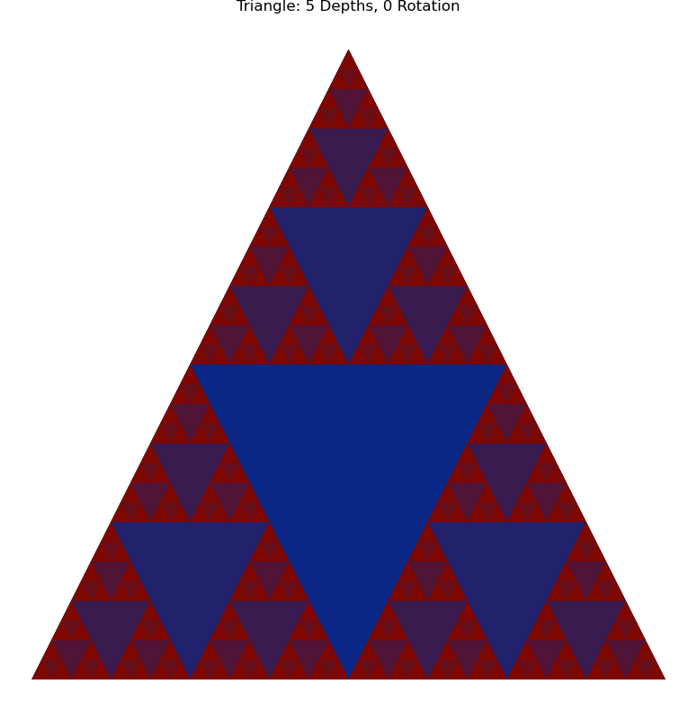
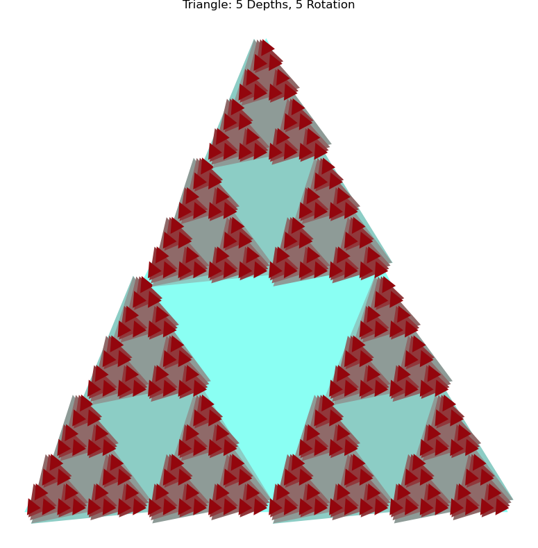
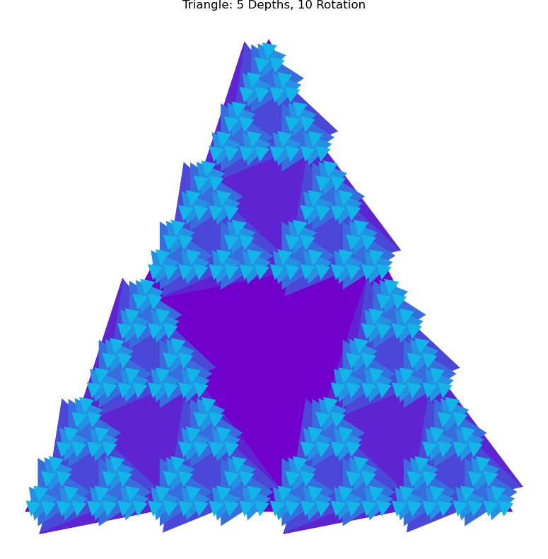
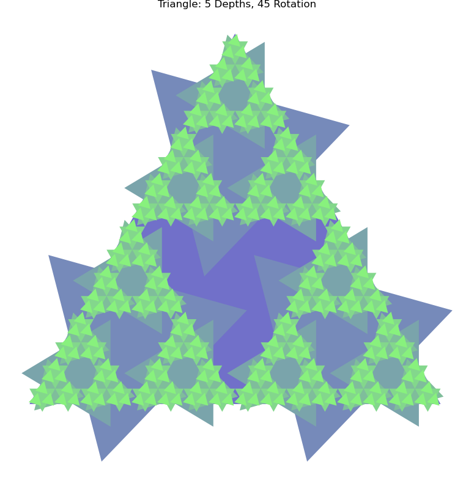
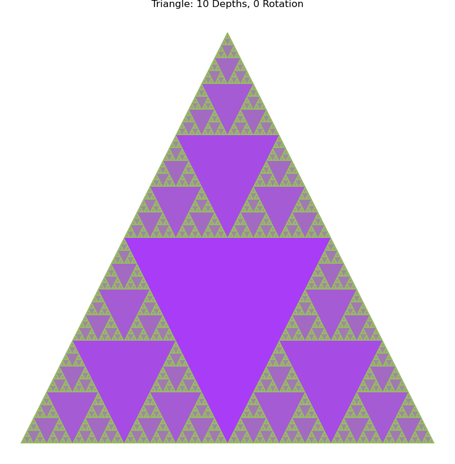

# Assignment 2: Exploring Fractals through Recursive Geometric Patterns

[View on GitHub]({{ site.github.repository_url }}) 

## Table of Contents

- [Pseudo-Code](#pseudo-code)
- [Technical Explanation](#technical-explanation)
- [Geometric Influences](#geometric-influences)
- [Parameters & Seeds](#parameters--seeds)
- [Appearance Mapping](#appearance-mapping)
- [Experiments](#experiments)
- [Challenges and Solutions](#challenges-and-solutions)
- [References](#references)

---

## Pseudo-Code

1. **Define Main Recursive Function**

triangle(start_pos, initial_length, depth, max_depth, rotation_step)

2. **Setup Parameters**

start_pos: Tuple (x, y) representing the bottom-left vertex of the triangle.

initial_length: The base length of the triangle at the current recursion level.

depth: The current recursion level.

max_depth: The maximum recursion depth.

rotation_step: The incremental rotation (in degrees) applied per recursion level.

3. **Construct for loop**

If depth > max_depth:

Return (Base case: stop recursion).

Else:

Compute the three triangle vertices:

A = start_pos

B = (A.x + initial_length, A.y)

C = (A.x + initial_length/2, A.y + sqrt(3)/2 * initial_length)

Construct a polygon tri using Shapely with points [A, B, C, A].

Apply a rotation transformation:

tri = rotate(tri, depth * rotation_step, origin='centroid')

Store (tri, depth) in the global list line_list.

If depth == max_depth:

Return (no further recursion).

Otherwise, calculate midpoints of triangle edges:

AB_mid, BC_mid, CA_mid

Recursive calls for smaller triangles:

triangle(A, initial_length/2, depth + 1, max_depth, rotation_step)

triangle(AB_mid, initial_length/2, depth + 1, max_depth, rotation_step)

triangle(CA_mid, initial_length/2, depth + 1, max_depth, rotation_step)

Return (after all recursive sub-triangles have been generated).

Define Visualization Function visualize_fractal(line_list, min_depth, max_depth, color_start, color_end, outlines=False)

4. **Group lines and add colour gradient**

line_list: List of (Polygon, depth) tuples.

color_start, color_end: Start and end colors for gradient.

5. **For loop to add gradient based on recursive depth**

Loop through each (tri, depth):

Interpolate color based on normalized depth value.

Plot or fill the triangle on the Matplotlib canvas.

Apply gradient coloring to emphasize recursion depth.

Initialize Parameters

start_pos = (0.0, 0.0)
initial_length = 1.0
max_depth = 5
rotation_step = 0

6. **Randomly select two colors to define the gradient**

color1 = mcolors.to_rgb(random_color())
color2 = mcolors.to_rgb(random_color())

7. **Generate and Visualize**

Clear any previous triangles.

Call triangle(start_pos, initial_length, 0, max_depth, rotation_step).

Call visualize_fractal(line_list, 0, max_depth, color1, color2).

Save the Image

Ensure images/ folder exists using os.makedirs("images", exist_ok=True).

8. **Save figure**

plt.savefig("images/fractal_triangle5.png", bbox_inches='tight', pad_inches=0)

---

## Technical Explanation

This program creates a recursive triangle-based fractal, where each triangle spawns three smaller triangles at each recursion level.

The recursion in the triangle() function drives the fractal growth:

Each call subdivides the current triangle into three smaller ones positioned at the original vertices and midpoints.

The recursive depth (depth) controls how many layers of subdivision occur.

The geometric relationships are based on the simple properties of triangles — each child triangle has a side length half that of its parent.

By applying rotate() from Shapely, a small rotation per recursion level can introduce spiral or wave-like distortions, depending on the rotation_step parameter.
The fractal’s color gradient is computed using linear interpolation between two randomly chosen RGB values, mapping depth and color intensity.

This process exhibits self-similarity — each triangle pattern contains smaller, identical copies — a defining property of fractals.

---

## Geometric Influences

- Recursive Subdivision

The fractal growth is governed by recursive geometric subdivision.

Each triangle generates three smaller triangles at half the scale, placed strategically at key geometric midpoints.

This geometric rule ensures consistent scaling and repetition across levels.

- Rotation Transformation

The rotation_step parameter introduces a rotational transformation relative to recursion depth.

Mathematically, each triangle is rotated by depth × rotation_step degrees around its centroid.

When rotation_step ≠ 0, the pattern evolves into a rotational fractal, introducing spiral symmetry and a dynamic sense of motion.

---

## Parameters & Seeds

| Figure | Depth | Angle Δ | Length L | Colour |
|1|5|0|1|Red/Blue|

| Figure | Depth | Angle Δ | Length L | Colour |
|2|5|5|1|Turquoise/Red|

| Figure | Depth | Angle Δ | Length L | Colour |
|3|5|10|1|Purple/Blue|

| Figure | Depth | Angle Δ | Length L | Colour |
|4|5|45|1|Purple/Green|

| Figure | Depth | Angle Δ | Length L | Colour |
|5|10|0|1|Green/Purple|

---

## Appearance Mapping

The colour mapping is based on the recursion depth. So a random colour gradient is chosing between to colours, the cahnge in colour is then reflected in the increased complexity of the fractal. The random colours can create som interesting themes at random.

---

## Experiments

With zero rotation and a depth of 5 the fractal is clean and simple.

With a rotation increment of 5 and depth of 5 the fractal is still easy to comprehend, but shows some rythm.

The rotation is increased to 10 with the same depth is becoming more chaotic.

The rotation is increased to 45 creating a whole new pattern, which not so recognizable from the typical serpinski triangle.

Here the depth of 10 took a few more seconds than usual, reflecting the exponentially increasing computational demand of each depth.

---

## Challenges and Solutions

Challenge: Maintaining consistent scaling and proportions between recursion levels.

Solution: Reduced the side length by half (initial_length / 2) at each recursion call, ensuring smaller triangles fit proportionally within the parent triangle without overlapping.

Challenge: Ensuring smooth color transitions between recursion levels.

Solution: Implemented a color interpolation function that linearly blends two RGB colors based on recursion depth, creating a continuous gradient across the fractal.

Challenge: Control the rotation of each recursive triangle and have it increased based on the depth.

Solution: Multiply the rotation_step with the current depth. Thus at depth 0 the rotation is 0 and ad each recursion the rotation is multiplied by the depth level. Thus 5 degrees rotation are at each depth: 0, 5, 10, 15 and so on.

---

## References
- **Serpinski Triangle Math Logic**: [https://www.youtube.com/watch?v=QPD5-wIedHM]
- **Shapely Manual**: [https://shapely.readthedocs.io/en/stable/manual.html](https://shapely.readthedocs.io/en/stable/manual.html)
- **Matplotlib Pyplot Tutorial**: [https://matplotlib.org/stable/tutorials/introductory/pyplot.html](https://matplotlib.org/stable/tutorials/introductory/pyplot.html)

---