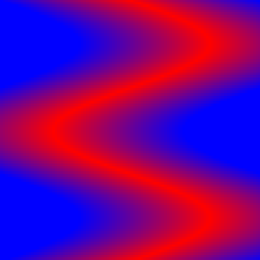
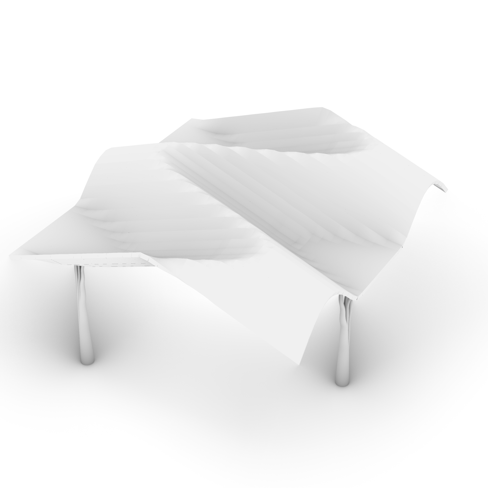
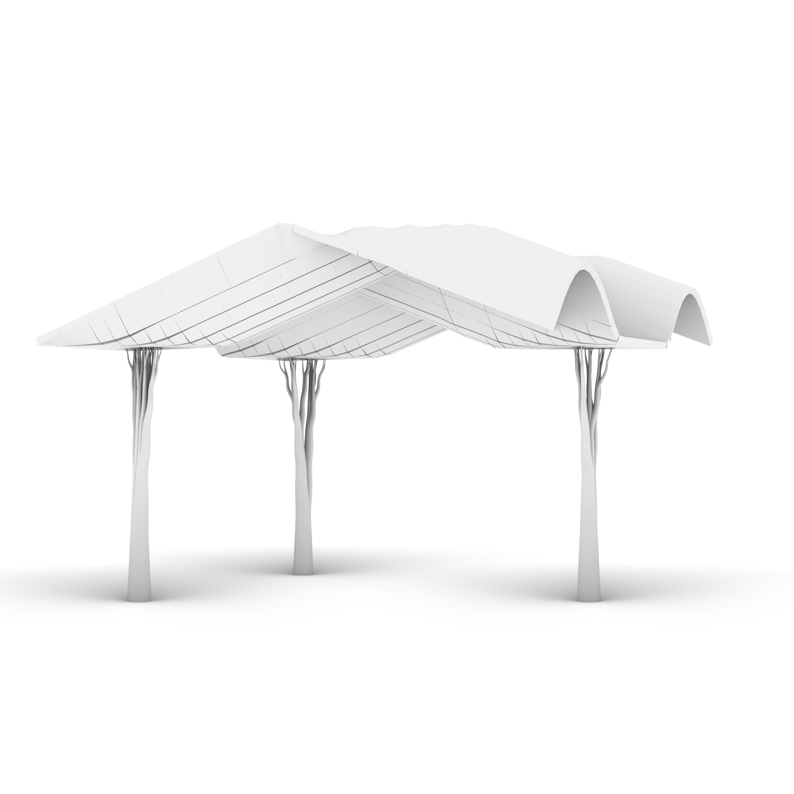
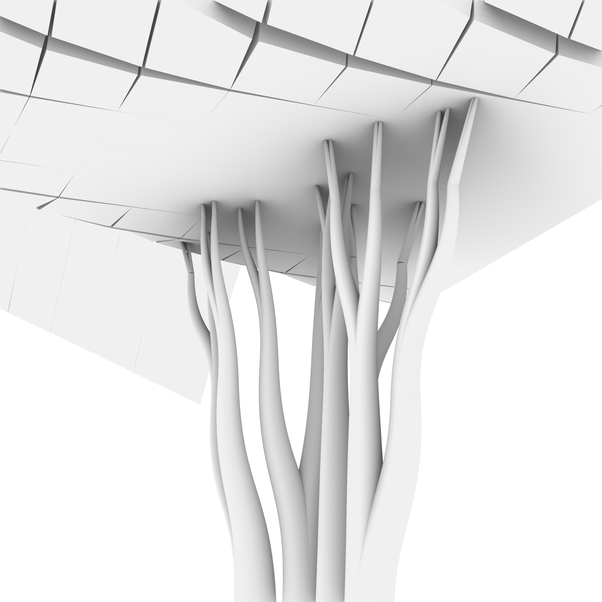
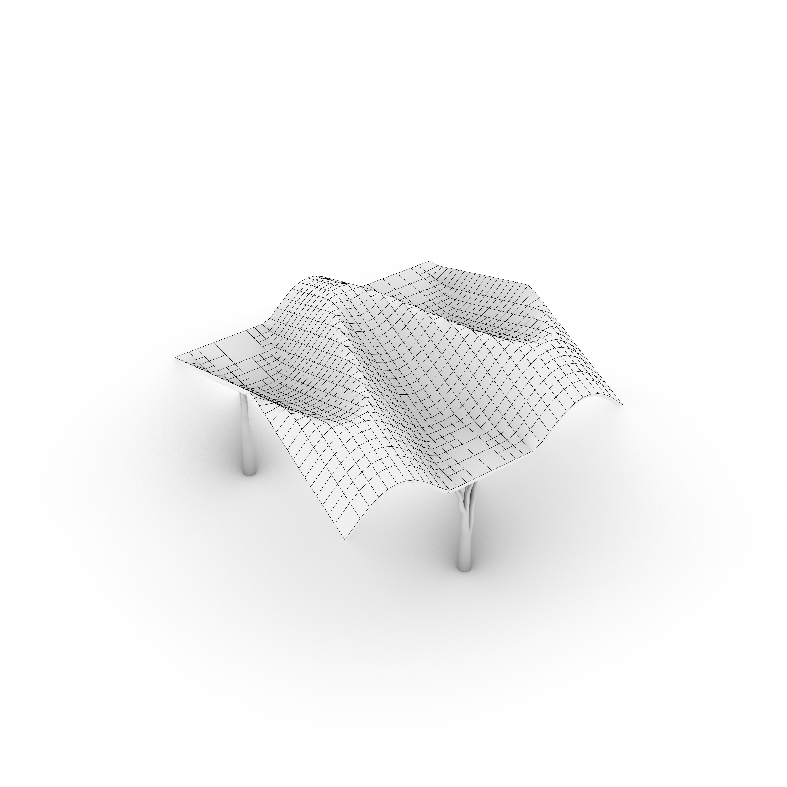
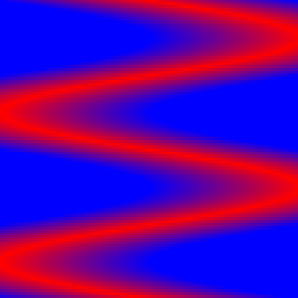
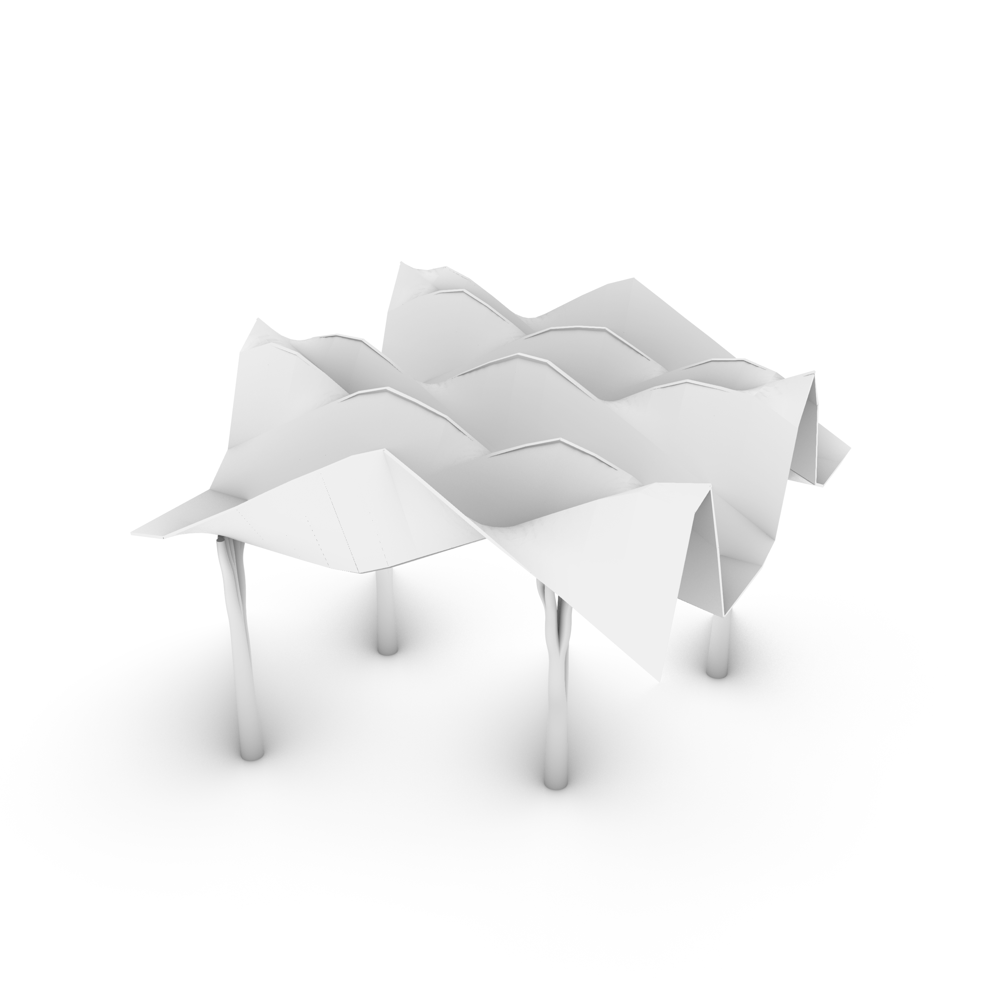
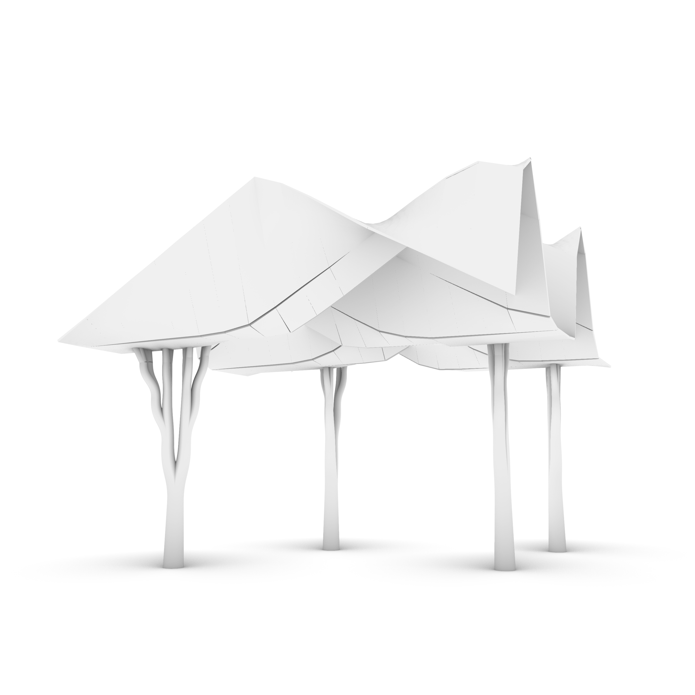
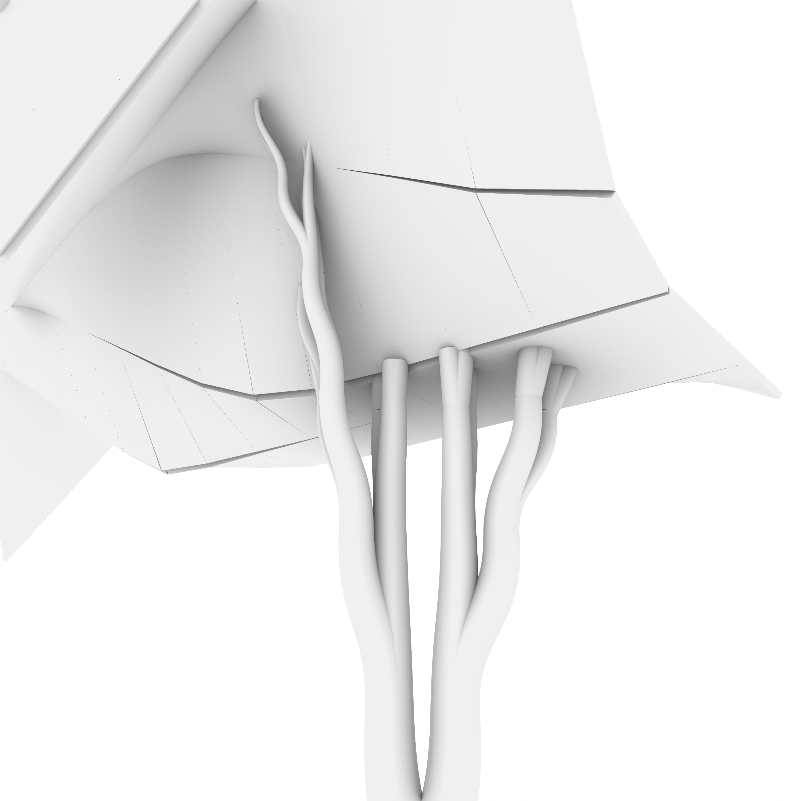
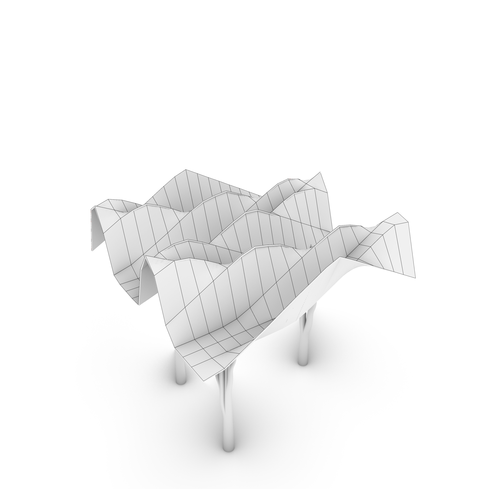

# Assignment 3: Parametric Structural Canopy

[View on GitHub]({{ site.github.repository_url }})

## Table of Contents

- [Pseudo-Code](#pseudo-code)
- [Technical Explanation](#technical-explanation)
- [Design Variations](#design-variations)
- [Challenges and Solutions](#challenges-and-solutions)
- [References and AI Acknowledgments](#references-and-ai-acknowledgments)

---

## Pseudo-Code
1. **Numpy driven heightmap**
*In VScode I tweaked the deliverable from assigment 1 to create more interesting surfaces from the numpy array. The code can be found in the file "Parametric_Canopy" under "NUMPY"*

2. **Inputs:**
H x W
Colour
Amplitude
Frequency

- Create an empty H×W RGB canvas
- Define two colors: one for the sine-wave center, one for the edges
- Compute a sine curve across image height -> gives center x-position per row
- For each pixel, compute distance from its x-coordinate to the sine curve
- Normalize distance -> blend between center_color and edge_color to fill the image

3. **Output:**
Numpy heightmap

4. **Parametric Canopy**
*In Grasshopper I have for my own sake divided the coding process into different python3 components, they each have a function and title and order of occurence, as will be explained sequentially in this chapter regarding the pseudo-code. The full grasshopper python code can be found in the file "Parametric_Canopy" under "GRASSHOPPER"*

```python
# 1. From image to points to surface.
# Inputs:
Image  # An existing image surface to sample
U, V    # sampling resolution
interpolate  #True/False interpolate surface

- Read the image and convert to bitmap
- Sampling the image based on U x V input in evenly spaced positions
- Sample each image RGB value and convert to x,y based on location and z based an colour
- Create surface from points: srf = rg.NurbsSurface.CreateThroughPoints

# 2. Find points on the surface for supports
#Inputs:
Surface # An arbitrary surface
U, V # sampling resolution
region_tol # control number of points to appear on planar surface

- sample points and normals of each point
- merge points with normals in the z direction
- compute the center point in each sampled region

#Output:
points # Points to place supports at

# 3. Generate branching supports
# Inputs
gen # Maxdepth recursion
angle # Max angle of outward growth
L # Scale each branch segment 0 -> 1
s # seed
height # amplitude of grown at each branching
pts # starting points for growth

- Starting point and direction of growth: plane = rs.PlaneFromNormal(pt, v)
- Angle of each branching: V1 = rs.VectorRotate(v, random.uniform(-angle, 0), rot_axis)
- Smooth the branching curve with guides "m" (no sharp angles): L = rs.AddCurve([pt, m3, m4, pt2])
- Let it grow:  Grow(pt2, V2, length * random.uniform(0.75, 0.95), g + 1)

# Output
Lines # Each line segment in a list

# 4. Trim supports at the surface
# Inputs
srf # The surface
lines # lines to trim
srf_z # z height of surface

- Move surface up by z value
- Find crv/srf intersection points: rg.Intersect.Intersection.CurveSurface(crv, srf_moved, 0.001, 0.001)
- Keep the curves between the starting point and intersection point
- Cull all curves above the surface by calculating the distance from the surface d > 0 -> cull

#Output
curves_out # The curves that act as supports

# 5. Variable pipe of the support curves (giving them thickness)
# Inputs
Crvs # curves to pipe
factor # starting radius

- Collect all start/end Z values and find max Z
- Normalize each start/end Z to (z_max - z) / z_max
- Multiply normalized values by factor input to get start/end radii
- Reparameterize each curve 0 to 1 and build a variable-radius pipe from radii [r0, r1]

# Output
pipes # The final brep supports

# 6. Tesselation of the surface
# Inputs
Surface # Surface to tesselate
UV # UV count to sample (resolution)
MaxAngle # maximum difference in angle to determine the same patch
MinSize # Minimum size of each patch/panel tesselation
MaxDepth # Maxiumum recursion of panel division, e.g. MaxDept=4 -> 8, 4, 2, 1

- Convert input surface to a NurbsSurface (It was a brep)
- Recursively subdivide the UV domain until normals vary less than MaxAngle or patch size < MinSize
- For each final patch, build a 4-corner mesh quad
- Store each quad mesh and its boundary polyline

# Output
patches # Tesselation panels
Edges # The curves dividng the panels

# 7. Convert the mesh to a brep and offset
# Input
Mesh # arbitrary mesh, but in this case the tesselated panels
brep # the tesselated panels
dist # Offset thickness
Solid # True/False
ext # false
tol # false

- For every mesh face, extract its 4 corner points
- Store these point-quads in FacesPts
- Try making a planar Brep from the 4 points, otherwise create a ruled/lofted surface
- Collect all successfully created Breps in Surfaces
- Offset the srf with Rhino.Geometry.Brep.CreateOffsetBrep(cbrep, dist, solid, ext, tol)

# Output
Surfaces # Brep types tesselated panels

# 8. Combine and group the out from varible pipe and offset components
Finally the outcome is a canopy with supports when combining the output from step 4 and 6.
```

# Technical Explanation
#### VScode

1. **Canvas Initialization**

A NumPy array of shape (height, width, 3) is created to hold RGB values in floating-point format.

2. **Color Definitions**

Two RGB colors are selected:

center_color for pixels lying on or near the sine curve.

edge_color for pixels far from the curve (left and right borders).

3. **Sine Curve Computation**

A vertical list of y-coordinates (0 -> height-1) determines the rows in the image.

For each y, a corresponding x-position is calculated
sine_middle = (width / 2) + amplitude * np.sin(frequency * y)
where A is the amplitude and f the frequency of the sine wave.

This produces a single-pixel-wide sine curve running from top to bottom,

4. **Distance Field Calculation**

A 1D array of x-pixel positions (0 -> width-1) is broadcast against the sine-center array.

For each pixel (x, y) the absolute distance to the sine path is computed

5. **Color Blending via Normalized Distance**

Distances are normalized to the range 0–1 by dividing by half the image width.

Each pixel blends linearly between the center and edge colors
where t is the normalized distance.

This produces a smooth gradient that radiates outward from the sine curve.

6. **Rendering and Export**

The final canvas is cast to uint8 (0–255) to become a proper image 

matplotlib.pyplot.imshow displays the result without axes.

The image is saved to a filepath as a PNG with no borders.

### Grasshopper
1. **Image-Based Heightfield Generation**

The workflow begins by reading a bitmap from a file path

A downsampled UV grid is computed (U × V) and each sample reads the corresponding pixel’s RGB values.

A function (0.2126R + 0.7152G + 0.0722B) converts colour to grayscale height, scaled by ScaleZ, producing a 3D Point3d: (x, y, Zheight).

All inputs are normalized so mixed Grasshopper/Rhino point inputs are converted to canonical Rhino.Geometry.Point3d objects.

2. **Point Grid Creation**

The flattened list of grayscale-derived points is reshaped into a regular UV lattice of size U×V.

This structured grid is essential for surface generation because each row and column becomes an isoparametric sampling of the heightfield.

3. **Surface Construction (NURBS Reconstruction)**

The UV-ordered point grid is passed into one of two RhinoCommon constructors:

NurbsSurface.CreateThroughPoints when interpolation is requested (maintains exact heights).

NurbsSurface.CreateFromPoints when a least-squares approximation is desired (smoother output).

This produces a continuous, smooth surface representing the grayscale image as a height-mapped topology.

4. **Low-Region Detection & Surface Sampling**

The NURBS surface is sampled at a secondary resolution (Ucount × Vcount) to get:

3D positions

Unitized normals

Z-elevations

The lowest 5% of points are identified, and their normals are averaged to estimate the dominant ground-plane orientation.

All points whose normals align (within 3°) and whose Z elevation lies within a tolerance of the global minimum Z are collected as candidates for support placement.

5. **Spatial Clustering of Flat Regions**

A bounding-box–scaled tolerance groups adjacent low regions into clusters using simple distance-based grouping.

Each cluster represents a “flat support zone.”

The centroid of each cluster becomes a base point from which structural supports are grown.

6. **Recursive Support Structure Generation**

A recursive branching algorithm (Grow) generates tree-like supports:

Starting from each centroid, a main trunk is generated along a vertical vector scaled by L.

Each branch splits into two children, with random planar rotations around a local frame (PlaneFromNormal).

Midpoints (m1–m4) create smooth cubic curves for branches.

Branch length decays per generation (0.75–0.95 multiplier).

This process yields an organic, self-similar, recursively developed support structure.

7. **Cutting Supports Against the Surface**

The input surface is temporarily moved upward by a user-defined offset (srf_z).

Each support curve is intersected with the elevated surface:

If an intersection occurs, the curve is trimmed from start → intersection point.

If no hit is found, the curve is conditionally kept only if its start point is below the displaced surface.

This produces supports that correctly terminate at the canopy rather than penetrating through it.

8. **Culling Supports Above/Below the Final Surface**

A true signed distance function is implemented using:

Closest surface point

Surface normal

Dot product between the normal and point-offset vector

Midpoints of curves determine whether a support lies above or below the surface.

Based on a boolean parameter (side), curves are kept or rejected.

9. **Variable-Radius Piping of Curves**

Curves are coerced into Rhino geometry and their start/end Z-values are collected.

Each Z-value is normalized against the global maximum Z to produce values in [0,1].

These normalised values are multiplied by a user factor to generate radii.

Each curve is reparameterized to 0–1 and piped using Brep.CreatePipe with different radii at start and end, emulating Grasshopper’s Pipe Variable component.

10. **Surface Tessellation via Adaptive Recursive Subdivision**

The surface is tessellated by recursively subdividing its UV domain:

Each patch samples 5 points (4 corners + center).

Normal variation is computed across all point pairs.

If variation < MaxAngle, patch size < MinSize, or depth > MaxDepth -> the patch becomes a final quad mesh face.

Otherwise the patch splits into four sub-patches.

This produces smooth-where-possible, detailed-where-necessary tessellation.

11. **Mesh-to-Brep Conversion and Offset**

Each face is extracted as four corner points

Surfaces are created:

First attempt: planar Brep from corner points

Fallback: ruled surface or loft between opposite edges

The resulting Breps are combined and offset using Brep.CreateOffsetBrep to produce a thickened shell for the final canopy.

12. **Final Structural Canopy Assembly**

The workflow’s outputs—tessellated panels, offset canopy shell, variable-radius pipes, and trimmed recursive supports—form the final architectural structure.

The pipeline integrates image-based height mapping, NURBS surface modeling, adaptive tessellation, organic branching supports into one procedural system.


---

# Design Variations
## Design A
#### Base Image


Amplitude: 30

Frequency: 3

H x W: 100

#### Rhino Arctic Render images 








#### Parameters
Curvature control: 2

UV count: 50

Region_tol: 0.40

Tree recursions: 5

Max angle of outward tree growth: 10

Scale of each branch: 0.8

Seed of tree fractal: 7

Surface height (canopy height): 180

Max angle difference fore tesselation: 2

Option min size of each tesselate patch: 0

Max step number of different patch sizes: 5

Radius at pipe base: 10

Surface thickness: 5

#### Description

The design features a frequency of 3 from the numpy image and is thus well-suited for 3 supports. The supports branch 5 times before reaching the surface. In the surface canopy one can clearly see the features of "surfaceimg1.png". The radius of the supports are set to a propertional 10 units and surface thickness is 5. In the image "DesignA.4" one can see the tesselate output aproaching a neat and smooth surface due to max step number for patches being 5 recursions.

## Design B
#### Base Image


Amplitude: 50

Frequency: 4

H x W: 100

#### Rhino Arctic Render images





Curvature control: 3
UV count: 50
Region_tol: 0.40
Tree recursions: 4
Max angle of outward tree growth: 10
Scale of each branch: 1
Seed of tree fractal: 8
Vector amplitude of each branch: 50
Surface height (canopy height): 180
Max angle difference fore tesselation: 2
Option min size of each tesselate patch: 25
Max step number of different patch sizes: 4
Radius at pipe base: 10
Surface thickness: 2

The design features a frequency of 4 from the numpy image and is thus well-suited for 4 supports. The supports branch 4 times before reaching the surface. In the surface canopy one can clearly see the features of "surfaceimg2.png". The radius of the supports are set to a propertional 10 units and surface thickness is thinner at 2 unites. In the image "DesignB.4" one can see the tesselate output being more rough with larger panels, as the recursion of patch sices is reduced to 4.

## Design C
Numpy image (images/surfaceimg1.png)
Amplitude: 40
Frequency: 5
H x W: 100

Rhino Arctic Render images (images/DesignA.1.jpg images/DesignA.2.jpg images/DesignA.3.jpg images/DesignA.4.jpg)
Curvature control: 2
UV count: 50
Region_tol: 0.30
Tree recursions: 8
Max angle of outward tree growth: 15
Scale of each branch: 1.0
Seed of tree fractal: 2
Vector amplitude of each branch: 40
Surface height (canopy height): 180
Max angle difference fore tesselation: 2
Option min size of each tesselate patch: 0
Max step number of different patch sizes: 6
Radius at pipe base: 5
Surface thickness: 5

The design features a frequency of 5 from the numpy image and is thus well-suited for 5 supports. The supports branch 8 times before reaching the surface. In the surface canopy one can clearly see the features of "surfaceimg3.png". The radius of the supports are set to a thinner 5 units and surface thickness is again 2 to get a smooth an elegant structure. In the image "DesignC.4" one can see the tesselate output is also smoother.

### Parameter Tables

| Design | amplitude | frequency | regtol | divU | divV | rec_depth | angle     | vec_amp    | n_div  | seed | radius    |
|-------:|----------:|----------:|-------:|-----:|-----:|----------:|----------:|-----------:|-------:|-----:|----------:|
| A      |    30     |       3   |  0.40  | 50   |  50  |     5     |   10      |    40      |   5    |  7   |   10      |
| B      |    50     |       4   |  0.40  | 50   |  50  |     4     |   10      |    40      |   4    |  8   |   10      |
| C      |    40     |       5   |  0.30  | 50   |  50  |     8     |   15      |    40      |   6    |  2   |   5       |


---

## Challenges and Solutions
- **Cannot offset mesh**: Convert mesh to brep and offset that
- **Lines above surface remain despite trim**: Cull all geometries above the surface. v
- **Variable piping was a challenge to solve**: Recreate the process in grasshopper, then with the help of chatgpt convert the grasshopper components to pieces of python code
- **Where to place the supports and by what logic**: Unify normals and find flat regions on the surface to grow the tree, then lift the surface up to the tree tops
---

## References and AI Acknowledgments
# References
- **3D fractal tree support creation video**
- https://www.youtube.com/watch?fbclid=IwY2xjawOKlbxleHRuA2FlbQIxMABicmlkETBidjQ3dGR4YXJ1aHZnekJkc3J0YwZhcHBfaWQQMjIyMDM5MTc4ODIwMDg5MgABHvh8ZMCp5-8LqZF3a4BgbIuUfKJFehfA2ViBAmO5EM9R0oJp-3j4K_0_ZgBg_aem_ZO59-8diG1cyIs5fFYlyow&v=wV6W69b-l7w&feature=youtu.be

- **Grasshopper components converted to RhinoScriptSyntax overview**
- https://developer.rhino3d.com/api/RhinoScriptSyntax/

- **Solid offset of a brep forum**
- https://discourse.mcneel.com/t/ghpython-offset-polysurface-created-in-grasshopper/144558/2

# AI prompts

--- ChatGPT was used to solve several problems, here is the subjects and the prompts i gave to the LLM i needed help with.

## Read input image
Load an image in GhPython and convert it into a 3D point cloud where X,Y = pixel positions and Z = brightness.

Use the sRGB luminance formula: Z = (0.2126 * R + 0.7152 * G + 0.0722 * B).

Explain why the coefficients 0.2126, 0.7152, 0.0722 are used for luminance. (it gave the values in an earlier question and i needed to know why, it had something to do with spikes from certain colours being more prominent in the RGB like Blue for example)

Add a Grasshopper slider called SampleCount to control downsampling resolution.

If SampleCount = N, output exactly N × N evenly spaced points across the image.

Perform nearest-pixel sampling to compute the Z value for each sampled point.

Ensure points span the full image width and height.

Output must work with “Surface From Points”: Pts, W, H, and SampleCount for U/V counts.

Create a NumPy-free GhPython script that loads a Bitmap from a file path or Grasshopper input. (Grasshopper doesnt have numpy)

Extract RGB from the raw BGR byte buffer.

Compute Z from RGB luminance.

Apply SampleCount downsampling to reduce the number of points.

Output the final point cloud for surfacing in Grasshopper.

## Tesselate surface
I have a surface input and I need to tessellate it adaptively based on normal variation so that:

Areas where the surface normals are similar form larger, flatter patches

Areas where the normals change rapidly (high curvature) form smaller patches

The tessellation is organic, not a uniform grid

The subdivision stops when the normal difference is below a threshold

Minimum patch size and maximum recursion depth control refinement

The result is a set of mesh patches

Convert each mesh patch into individual Brep surfaces, one Brep per mesh face

This requires deconstructing each mesh

Extracting the corner points of each face 

Creating a planar Brep surface from those points

Handling GUID inputs safely (Rhino document references)

Outputting a collection of Breps, one per face

## Variable pipe (I described the process i did in grasshopper to get a python code)
Start with a list of curves (crvs).

Connect crvs to an End Points component.

Take the Start output of the End Points component and connect it to a Deconstruct Point component.

Take the End output of the End Points component and connect it to another Deconstruct Point component.

Extract the Z values from both Deconstruct Point components and connect them to a Bounds component.

Connect the output of the Bounds component to a Deconstruct Domain component.

From the Deconstruct Domain component, take the End domain value and feed it into the A input of two separate Subtraction components.

For the first Subtraction component, connect B to the Z value of the start points (from the Start Deconstruct Point).

For the second Subtraction component, connect B to the Z value of the end points (from the End Deconstruct Point).

Take the outputs of both Subtraction components:

Connect the first subtraction result to the A input of a Division component.

Connect the second subtraction result to the A input of another Division component.

For both Division components:

Connect the B input to the End Domain value from the Deconstruct Domain output.

Take the result outputs of both Division components and connect them to a Weave component:

Graft the 0 and 1 inputs of the Weave component.

Feed the first division result into input 0.

Feed the second division result into input 1.

Take the W output of the Weave component and multiply it by a numeric factor.

This factor will also be an input for the Python component you will create.

Prepare the Pipe Variable component:

Connect crvs to the Curves input (reparameterize + graft).

Provide a multiline list of 0 and 1 values to the Parameters input.

Connect the multiplied output from earlier into the Radius input.

The output gives the variable-radius piped curves.