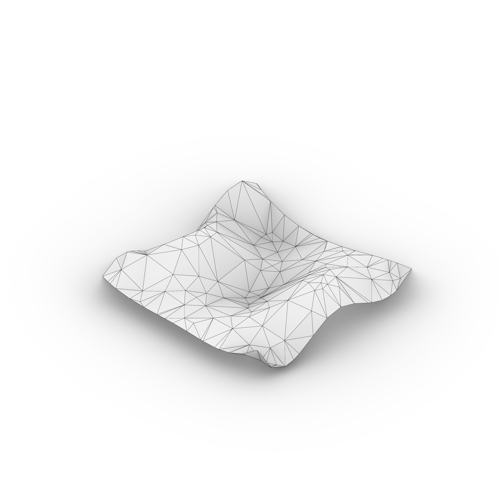
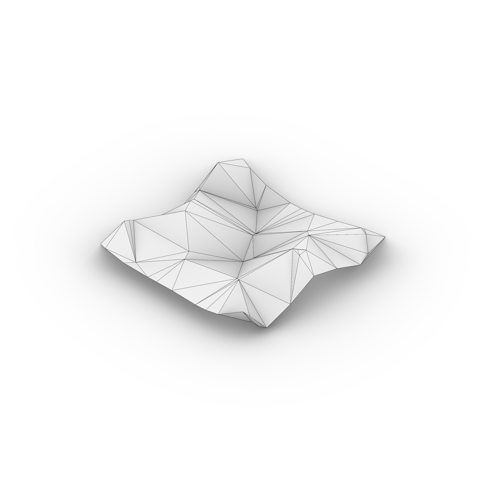
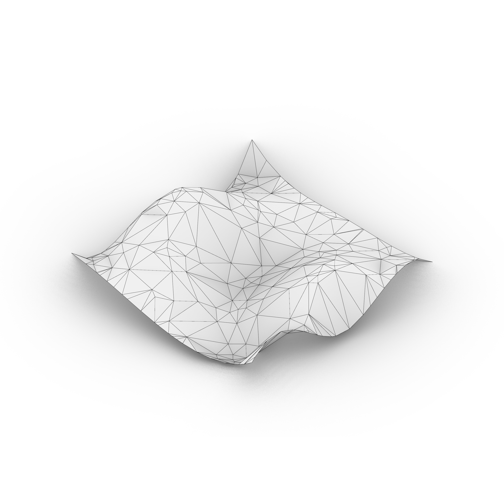
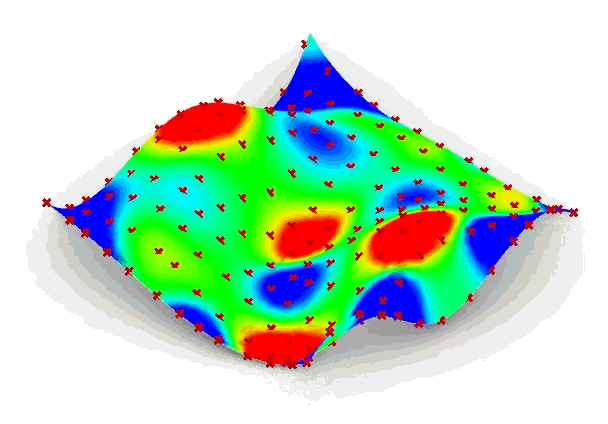

# Assignment 4: Agent-Based Modeling for Surface Panelization

[View on GitHub]({{ site.github.repository_url }})

## Table of Contents

- [Project Overview](#project-overview)
- [Pseudo-Code](#pseudo-code)
- [Technical Explanation](#technical-explanation)
- [Design Variations](#design-variations)
- [Challenges and Solutions](#challenges-and-solutions)
- [AI Acknowledgments](#ai-acknowledgments)
- [References](#references)

---

## Project Overview

I started from a smooth, continuous surface, derived from a UV grid of points with random z-coords, which contains areas of varying curvature and slope. This surface acts as a geometric field rather than a fixed mesh: all agent behavior is evaluated relative to the underlying surface parameters (UV space and surface normals), allowing the system to adapt dynamically to local geometric conditions.

The primary geometric signal driving the system is Gaussian curvature, sampled directly from the surface. Agents are attracted toward regions of higher curvature, effectively climbing curvature gradients in UV space. At the same time, a spatial interaction signal, agent-to-agent distance, is used as a repulsive force. This prevents agents from collapsing into a single location and enforces a variable spacing logic: in highly curved regions, agents can pack more densely, while in flatter regions they spread out. These two signals (curvature as an attractor and distance as a repulsor) are combined each iteration to control agent movement and convergence.

The panelization strategy is an adaptive tessellation based on agent density. Once the agents converge (when their movement falls below a threshold relative to local spacing), their final positions are used to generate a Delaunay triangulation in the surface’s UV domain, which is then mapped back onto the 3D surface. This produces many small panels in areas of high curvature and fewer, larger panels in flatter regions, directly reflecting fabrication and assembly logic in the real world.

---

## Pseudo-Code
### Surface generator

Validate input U, V; abort if either is missing or < 2

Assign default values to ZVar, ExtU, ExtV if not provided

Initialize deterministic random generator using Seed

Compute surface degrees:

deg_u = min(3, U - 1)

deg_v = min(3, V - 1)

Create parametric coordinate arrays u_coords and v_coords

Build 2D grid using meshgrid

Generate random height field Z within [-ZVar, +ZVar]

Flatten (X, Y, Z) grids into ordered point list

Convert values to Point3d

Construct NURBS surface using CreateThroughPoints

Output generated surface S

---

### Surface divider

Accept input geometry S as Surface or Brep

If Brep, extract first face as working surface

Clamp subdivision counts U, V to valid integers

Read surface parameter domains u_dom, v_dom

Loop over (U+1) × (V+1) UV grid

Interpolate parameters u_t, v_t

Evaluate surface point using PointAt(u_t, v_t)

Compute surface normal using NormalAt(u_t, v_t)

If normal is invalid, compute fallback normal from derivatives

Store sampled:

P → surface points

N → normals

uv → UV coordinates

---

### Agent builder

Validate surface input S

Generate unique AgentKey using component InstanceGuid

Read input agent positions P

If Reset is True, overwrite sticky storage with input points

If sticky storage is missing or mismatched, reinitialize from input

Copy sticky points into current agent state

For each agent:

Project point to surface using ClosestPoint

Compute and normalize surface normal

Compute Gaussian curvature at (u, v)

Output:

P_out → agent positions

N_out → normals

C → curvature values

AgentKey

BuilderComp

---

### Agent simulator

Resolve sticky storage key from BuilderComp or AgentKey

Retrieve agent state from sticky memory

Read simulation parameters Step, Rep, Run, Reset

Compute UV step sizes from surface domain and Step

If Run is True:

For each agent:

Find closest (u, v) on surface

Measure current Gaussian curvature

Sample neighboring UV positions

Select UV direction with maximum curvature

Move agent toward best curvature position

Compute repulsion force from nearby agents

Apply repulsion offset

Project final position back to surface

Store updated agent positions back into sticky

If Run is False:

Only evaluate curvature at current agent positions

Output:

P_out → updated positions

N_out → normals

C → curvature values

---

### Panelization

Validate agent points and surface input

Convert Brep face to NurbsSurface if needed

Project agent points to surface UV coordinates

Add evenly sampled UV boundary points

Perform Delaunay triangulation in UV space

Map UV mesh vertices back onto surface

Construct 3D mesh from triangulation

Extract unique mesh topology edges as curves

For each mesh face:

Attempt planar Brep creation

Fallback to corner-point Breps if planar fit fails

Output:

Lines → panel edges

Panels → Brep panels

Mesh3D → triangulated surface mesh

---

## Technical Explanation

### 1. Overall Pipeline

The system follows a iterative pipeline that transforms an abstract surface into a rationalized panelized geometry driven by agent behavior.

First, a base surface is generated procedurally in surface_generator.py, producing a controllable NURBS surface with embedded geometric variation.

Next, geometric signals are implicitly available from the surface itself, most importantly Gaussian curvature, which acts as the primary scalar field guiding agent behavior.

Agents are initialized in agent_builder.py by sampling the surface at regular UV intervals and storing their state persistently.

The simulation in agent_simulator.py iteratively updates agent positions based on local curvature maximization and inter-agent repulsion.

Finally, the evolved agent positions are converted into mesh topology and planar panels in the panelization stage, producing the final geometric output.

---

### 2. Surface Generation and Fields


The surface is generated procedurally using a structured UV grid combined with a random height field, similar in spirit to a heightmap approach but directly embedded into a NURBS surface.

This allows the surface to remain analytically smooth while still containing high- and low-curvature regions that meaningfully affect agent behavior.

Rather than precomputing discrete field arrays, curvature is evaluated on demand using Rhino’s CurvatureAt(u, v) method.

Gaussian curvature acts as a continuous scalar field defined over the surface’s UV domain.

Agents operate in UV space; their (u, v) coordinates are obtained via ClosestPoint, ensuring robustness even after repulsion or movement.

This direct surface querying avoids discretization artifacts and keeps agent decisions tightly coupled to the underlying geometry.

---

### 3. Geometric Signals and Agent Behaviors

Curvature is the primary driving signal in the system.

At each simulation step, agents sample curvature at their current location and at neighboring UV offsets.

Agents always move in the direction of increasing Gaussian curvature, effectively climbing toward ridges, peaks, and areas of geometric tension.

This behavior concentrates agents in zones that require higher geometric resolution.

Distance-based interaction acts as a secondary signal through repulsion.

Agents measure distances to nearby agents and apply a repulsive force when they are closer than a locally estimated interaction radius.

Repulsion prevents clustering collapse and enforces a minimum spacing between agents.

Signals are combined using a rule-based approach rather than weighted sums.

Curvature defines the preferred direction of movement, while repulsion modifies the resulting candidate position before projection back onto the surface.

This hierarchy ensures that geometric intent dominates while still maintaining spatial balance.

---

### 4. Agent Life-Cycle and Interactions

Agents are persistent entities whose state is stored across solver iterations using Grasshopper’s sticky memory.

There is no explicit spawning or death of agents; instead, the system assumes a fixed population whose spatial distribution evolves over time.

Interaction between agents is limited to pairwise repulsion.

There is no alignment or cohesion rule, as the goal is not flocking but geometric sampling.

Repulsion ensures agents distribute themselves evenly within curvature-driven attractor zones.

This interaction directly affects the final panelization by controlling local point density and preventing degenerate or overly small panels.

---

### 5. Simulation and Panelization Strategy

The simulation typically runs for a user-controlled number of steps, or interactively until the agent distribution stabilizes.

A single iteration corresponds to one local optimization step per agent.

There is no global stopping criterion; instead, the designer visually evaluates convergence.

Once the simulation reaches a satisfactory state, the final agent positions are used as seeds for panelization.

Agent points are projected into UV space, combined with boundary samples, and triangulated using Delaunay mesh.

The resulting UV mesh is mapped back onto the surface to generate a 3D mesh.

Each mesh face is converted into a planar Brep panel.

High-curvature regions naturally result in smaller, denser panels due to agent clustering.

Low-curvature regions produce larger, fewer panels.

This strategy rationalizes the surface by aligning panel density with geometric complexity.

---

### 6. Multi-Module Design

- The project is split into multiple modules to separate tasks and improve clarity.

- Surface_generator.py is responsible only for geometry creation and remains independent of agents or simulation logic. 

- Agent_builder.py handles initialization, identity etc.

- Agent_simulator.py focuses exclusively on behavioral logic.

- Panelization is isolated as a post-processing step that interprets simulation results without influencing agent behavior. 

- This modular structure allows individual components to be swapped, extended, or reused. 
For example, alternative surfaces, additional signals, or new agent rules can be introduced without rewriting the entire system.

## Design Variations
Design varations where created on the same surface (seed: 6) with different input parameter to get 3 different panelization results based on number of agents, curvature and repulsion, as described in the next section.

### Parameter and Signal Table

```markdown
| Design | Signals Used                     | Key Parameters                                           | Notes                                    |
|--------|----------------------------------|----------------------------------------------------------|------------------------------------------|
| 1      | curvature + Repulsion            | n_agents=100, step=0.5, repulsion=0.5                    | Moderate values all-rounded panelizaiton |
| 2      | curvature + low repulsion        | n_agents=49, step=0.5, repulsion=0.2                     | few agents, big panels and low repulsion |
| 3      | curvature + low step & repulsion | n_agents=144, step=0.1, repulsion=0.1                    | high # of agents and low step and rep    |
```

### Variation 1:



- **Signals Used**: curvature and repulsion
- **Parameters Changed**: n_agents: 100, step: 0.5, repulsion: 0.5
- **Description**: The step is moderate and so the agents are moving alot at each tick rate, the repulsion ensure they are never completely gathered at one place, and thus the panilzation is only slightly changed due to curvature, but it is noticable. There are relatively few agents so the panels are sizeable. Panelization is somewhat akin to the initial surface.

### Variation 2:



- **Signals Used**: curvature and low repulsion
- **Parameters Changed**: n_agents: 49, step: 0.5, repulsion: 0.2
- **Description**: The relatively little amount of agents lead naturally to fewer and larger panels, the low repulsion leads to the panels' corners meeting around high curvature zones. This is the varaition that is furthest away from the initial surface.

### Variation 3:



- **Signals Used**: curvature, low step and low repulsion, high # agents
- **Parameters Changed**: n_agents: 144, step: 0.1, repulsion: 0.1
- **Description**: A high number of agents leads to many panels created. The simulation was les demanding with a smaller step size, the repulsion was likewise lowered otherwise the points would simply stay put due to being repulsed by eachother. It is clear to se that clusters of points at tops and valleys on the surface. With the method this is the variation that closest allign to the orginal surface.

### Agent trajectories:

- **Proof of concept**: A short gif showing the points moving to areas of high curvature.

---

## Challenges and Solutions

- **Agent clustering**
- Agents clustering at the same spots of high curvature
- The solution must be some kind of repulsion so that they avoid meeting at exactly the same point
- Implemented distance based interaction between individual agents to ensure they do not collide or overlap thus creating weird panels.

- **Multi-module design**
- At the outset i had created a divide surface component and simply moved the points to high curvature areas in one component, not yet grasping the divison into agent builder and simulator
- I needed to implement agent based behavior and the trigger so that it was not simply a computational task that identified high curvature areas, but actual agents as points that moved towards them iteratively
- I implemented the trigger component and other logics from the "boids" tutorial file we used in one of the lectures. Then I prompted ChatGPT to divide the tasks of the script into an agent simulator and agent builder. This then had it own problems and bug-fixing asociated with that process, which i explain in the next paragraph.

- **Connecting agent builder to the simulation**
- Altough the setup seemed logical the points where not moving
- something was lost in translation between the agent builder and agent simulator, which stemed from a problem that chatgpt probably created when dividing the initial code into these two modules. I went back to prompting chatgpt to bugfix it as i thought the problem was a typo, as in a variable called two slightly different things i each module so they where not called probably
- Chatgpt suggested an agent key, since grasshopper scripts are stateless by default: Every recompute -> everything resets and no memory of previous position. The agent key stores the positions of the agent instances between each iterative tick during the simulation.

---

## AI Acknowledgments
AI was used to help with my understanding, ensuring operations are agent based, convert grasshopper components and logic to python code and bugfixing.
The following is the problem it self and the prompts used ad hoc to get a sufficient result.

**Divide agent system into builder and simulator**

I have an agent-based system in Grasshopper implemented as a single Python 3 component, but it has become two seperate components reflecting builder and simulator

An Agent Builder component that is responsible only for:

Initializing agent positions from input geometry (points from divide surface component)

Assigning agent IDs

Creating any initial per-agent data (position, normal, state)

Storing agents in a way that persists across Grasshopper components

An Agent Simulator component that:

Takes the initialized agents as input

Updates their positions based on geometric signals (surface curvature)

Advances the simulation by one or more steps

Preserves agent identity and state between iterations

**Convert Grasshopper “Divide Surface” into a Python 3 component**

I want to replicate the behavior of Grasshopper’s Divide Surface component using a Python 3 script component.

The component should:

Take a Surface input

Take integer inputs for:

Number of divisions in the U direction

Number of divisions in the V direction

Work correctly for surfaces only

Respect the surface’s parameter domains rather than assuming 0–1 UV space

The Python component should:

Evaluate points on the surface using surface domains

Generate a grid of division points in UV space

Convert those UV parameters into 3D points on the surface

**Fix agent simulator bug where points do not move**

I have an agent simulator written in a Grasshopper Python 3 component where agents are supposed to move across a surface based on curvature and repulsion forces.

However, the points appear not to move at all, even though the movement logic seems correct.

The system uses persistent state (e.g. scriptcontext.sticky) to store agent positions between iterations.

I need to:

Diagnose why agent positions are being reset or overwritten every Grasshopper recomputation

Identify whether the issue is caused by:

Incorrect use of sticky keys

Reinitializing agents unintentionally

Mismatched input/output agent counts

Typo hindering calls

Ensure that each agent has a stable, unique key that persists across runs

Also explain why using a single global key causes agents to appear frozen, and how introducing a unique agent key or per-component key resolves the issue.

Provide guidance on how to structure sticky storage so agents only update when intended, and how to combine Run, Reset, and persistent state without breaking the simulation or having any of them confuse eachother or overwrite them.

---

## References

- **ChatGPT**
- Prompts described in AI Acknowledgements

- **Grasshopper components converted to RhinoScriptSyntax overview**
- https://developer.rhino3d.com/api/RhinoScriptSyntax/